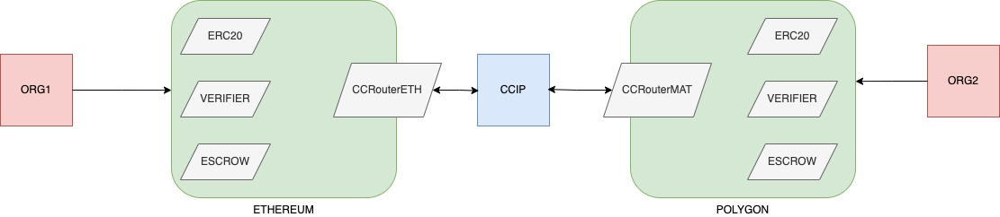

# wat (Whisper Asset Manager for Constellation)

## Confidential Transactions using Zero-Knowledge Proofs (ZKP)

### Build & Run API Server

Swagger UI URL: <http://localhost:3000/api> default port 3000 may need change based on environment variable PORT

```sh
npm install
npm start

`OR`

npm run start:dev (if you want run in Dev node, where server restaer on code change auto-magically)
```

### Pre-requisites (to run from command line)

1.Circom (which also depends on Rust) <https://github.com/iden3/circom/blob/master/mkdocs/docs/getting-started/installation.md>

Installing dependencies
curl --proto '=https' --tlsv1.2 <https://sh.rustup.rs> -sSf | sh

Installing circom follow steps

Installing snarkjs: snarkjs is a npm package that contains code to generate and validate ZK proofs from the artifacts produced by circom.

npm install -g snarkjs

2.Node JS

### Build Instructions

1.Pre-requisites

Trusted Setup, either create your own ptau file or you can use this one pre-generated (not recommended for production):

```sh
 wget https://hermez.s3-eu-west-1.amazonaws.com/powersOfTau28_hez_final_12.ptau -O ./data/powersOfTau28_hez_final_12.ptau
```

3.Sender ZKP

In the first step, we compile the circuit by the circom compiler that will generate a wasm and an r1cs file.

```sh
circom src/circom/confidential_transaction_sender.circom --wasm --r1cs -o ./build/circom
```

Now we can generate the proving key (zkey file) by using the circuit and the ptau file:

```sh
snarkjs groth16 setup build/circom/confidential_transaction_sender.r1cs data/powersOfTau28_hez_final_12.ptau keys/sender_proving_key.zkey
```

Now generate the verification key from the proving key

```sh
snarkjs zkey export verificationkey keys/sender_proving_key.zkey keys/sender_verification_key.json
```

Now generate a verifier for smart contracts (Solidity)

```sh
snarkjs zkey export solidityverifier keys/sender_proving_key.zkey build/solidity/sender_verifier.sol
```

The generated solidity code can be installed on-chain

3.RECEIVER ZK-SNARK

In the first step, we compile the circuit by the circom compiler that will generate a wasm and an r1cs file.

```sh
circom src/circom/confidential_transaction_receiver.circom --wasm --r1cs -o ./build/circom
```

Now we can generate the proving key (zkey file) by using the circuit and the ptau file:

```sh
snarkjs groth16 setup build/circom/confidential_transaction_receiver.r1cs data/powersOfTau28_hez_final_12.ptau keys/receiver_proving_key.zkey
```

Now generate the verification key from the proving key

```sh
snarkjs zkey export verificationkey keys/receiver_proving_key.zkey keys/receiver_verification_key.json
```

Now generate a verifier for smart contracts (Solidity)

```sh
snarkjs zkey export solidityverifier keys/receiver_proving_key.zkey build/solidity/receiver_verifier.sol
```

The generated solidity code can be installed on-chain

4.New Account ZKP (for prove zero balance)

A ZKP is required for new account creation with a zero balance to prove that the resulting hash value is calculated from a zero balance plus the account salt value.

In the first step, we compile the circuit by the circom compiler that will generate a wasm and an r1cs file.

```sh
circom src/circom/confidential_transaction_new_account.circom --wasm --r1cs -o ./build/circom
```

Now we can generate the proving key (zkey file) by using the circuit and the ptau file:

```sh
snarkjs groth16 setup build/circom/confidential_transaction_new_account.r1cs data/powersOfTau28_hez_final_12.ptau keys/new_account_proving_key.zkey
```

Now generate the verification key from the proving key

```sh
snarkjs zkey export verificationkey keys/new_account_proving_key.zkey keys/new_account_verification_key.json
```

Now generate a verifier for smart contracts (Solidity)

```sh
snarkjs zkey export solidityverifier keys/new_account_proving_key.zkey build/solidity/new_account_verifier.sol
```

The generated solidity code can be installed on-chain

### Run sender and receiver tests in NodeJS

1. Run the Sender Prover and Verifier in NodeJS

```sh
node src/js/sender_test.js --sendamount=100 --senderstartingbalance=1000 --sendersalt=1234567890
```

To pass the jsonCallData output to Solidity verification contract (on-chain):
a.Remove trailing "n" from all numbers
b.first and last "[" "]"
c.Remove all all carriage returns/line feeds

2.Run the Receiver Prover and Verifier in NodeJS

```sh
node src/js/receiver_test.js --sendamount=100 --receiverstartingbalance=1000 --receiversalt=987654321
```

To pass the jsonCallData output to Solidity verification contract (on-chain):
a.Remove trailing "n" from all numbers
b.first and last "[" "]"
c.Remove all all carriage returns/line feeds

3. Run the New Account Prover and verifier in NodeJs

```sh
node src/js/newAccount_test.js --receiversalt=987654321
```

## Transfer Asset from ETH <> MATIC

Smart Contracts needed

1.Ethereum (Sepolia)<br>
TokenETH - ERC20/ERC1155/ERC721<br>
EscrowETH - to lock & burn Token<br>
CCIPMsgContractETH - To send Msg across the CCIP network<br>
VerifierETH - To Verify ZK proof<br>

2.Polygon (Mumbai)<br>
TokenMAT - ERC20/ERC1155/ERC721<br>
EscrowMAT - to lock & burn Token<br>
CCIPMsgContractMAT - To send Msg across the CCIP network<br>
VerifierMAT - To verify ZK proof<br>



### Flow

1.RequestTransferMsg

    Reciever => Sender
    1.Reciever invokes an API with payload

```JSON
{
    "transferAmount":100,
    "tokenName": "tokenA",
    "requesterAddress": "xxx",
    "senderAddress": "yyy"
}
```

API should call

```js
CCRouterMat.sendRequestMsg(address requester, bytes32 encryptedAmount/transferAmountHash, string tokenName, bytes32 proof)
```

```js
Client.EVM2AnyMessage memory message = Client.EVM2AnyMessage({
            receiver: abi.encode(receiver),
            data: abi.encode(messageText),
            tokenAmounts: new Client.EVMTokenAmount[](0),
            extraArgs: "",
            feeToken: payFeesIn == PayFeesIn.LINK ? i_link : address(0)
        });

```

    Reciever send Transfer request with transferAmountHash

LockAssetMsg

    Sender => Rec
    Sender Takes TransferAmount and generates proof of balance and balanceAfter Transfer
    Sender Locks the asset in escrow Contract

MintAssetMsg

    Rec => Sender

BurnAssetMsg

    Sender => Rec

RequestComplete

    Rec => Sender
