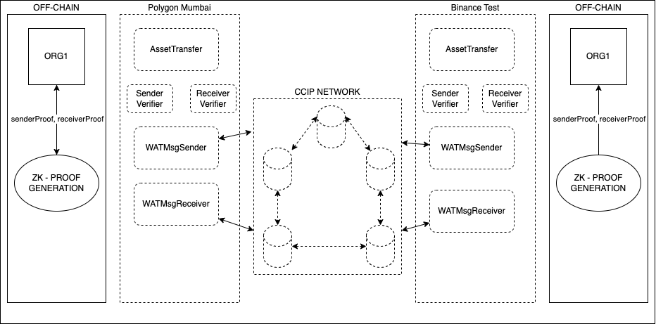
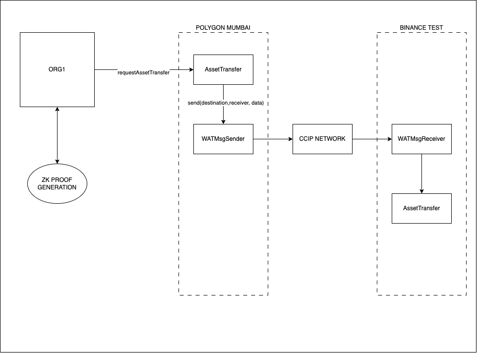
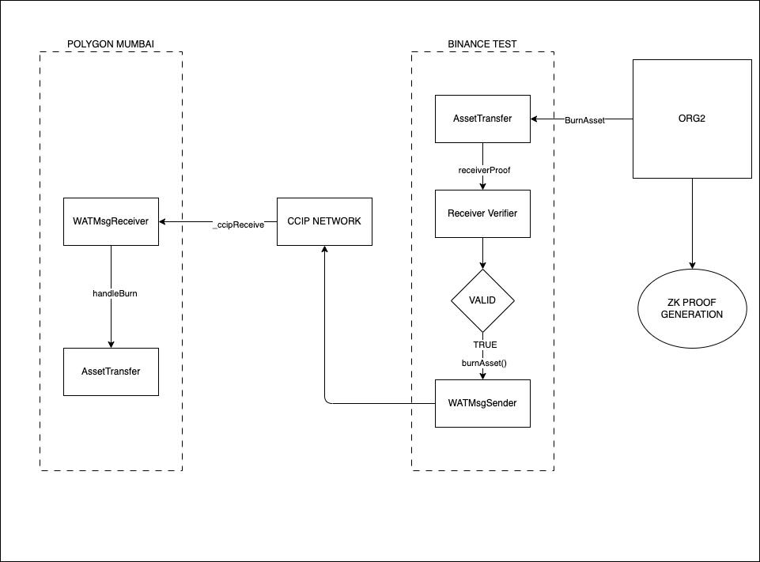
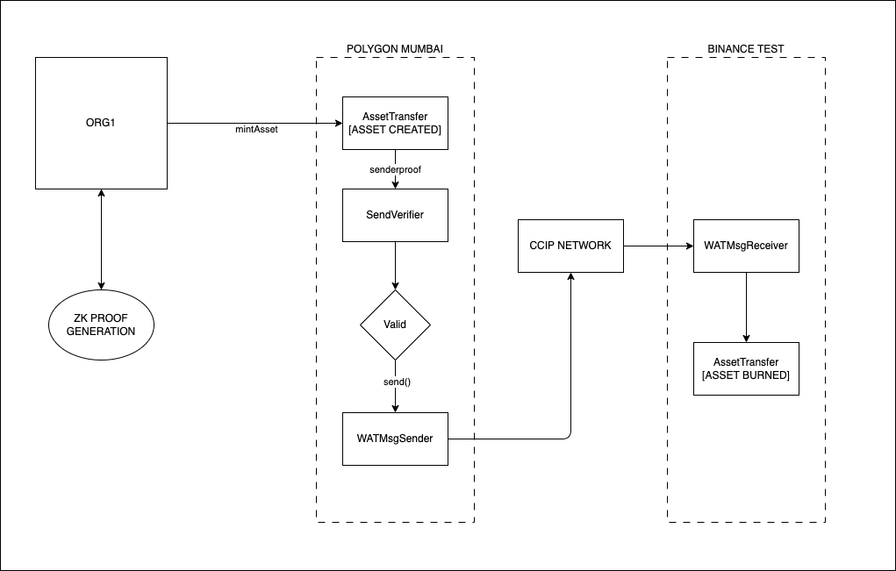

# Whisper Asset Manager

## Introduction

Whisper asset transfer represents a sophisticated method of transferring digital assets across different blockchain networks. This process leverages the Cross-Chain Interoperability Protocol (CCIP) and zero-knowledge (zk) proofs to ensure security, privacy, and efficiency.

## Key Components

- **CCIP (Cross-Chain Interoperability Protocol)**: Facilitates communication and asset transfer between disparate blockchain networks.
- **Zero-Knowledge Proofs**: Allows for the verification of transactions without revealing any sensitive information about the assets or the parties involved.

## Architecture



## Asset Transfer Process

1. **Initiation on Source Chain**:

   - The asset is locked or earmarked in the source blockchain using a smart contract.
   - A cryptographic proof or signal is generated to signify the locking event.

2. **Cross-Chain Communication via CCIP**:

   - The CCIP is used to relay the asset transfer request and the cryptographic proof from the source chain to the destination chain.

3. **Verification on Destination Chain**:

   - The destination chain receives the transfer request and cryptographic proof.
   - Zero-knowledge proofs are utilized to validate the authenticity of the transfer without compromising privacy.

4. **Completion of Transfer**:
   - After successful verification, the asset is released or replicated on the destination chain.
   - The recipient can now access the asset on the destination blockchain.

## Security and Privacy

- **Zero-Knowledge Proofs**: Ensure that transaction details remain private while confirming their validity.
- **CCIP**: Provides a secure and reliable method for cross-chain communication, safeguarding the integrity of the asset transfer.

## Advantages

- **Interoperability**: Enables asset movement across diverse blockchain ecosystems.
- **Enhanced Security**: Strengthens the protection of cross-chain transactions.
- **Privacy Preservation**: Maintains confidentiality of transaction specifics.
- **Efficiency**: Improves time and cost efficiency in cross-chain transfers.

## Potential Use Cases

- **Decentralized Finance (DeFi)**: Transferring assets across various DeFi platforms on different blockchains.
- **Non-Fungible Tokens (NFTs)**: Cross-chain transfer of NFTs for broader market accessibility.
- **Cross-Chain Exchanges**: Enabling trades between different cryptocurrencies across blockchain networks.

## Challenges and Considerations

- **Technical Complexity**: Implementation demands advanced technical expertise.
- **Network Compatibility**: Ensuring seamless interoperability among different blockchains.
- **Regulatory Compliance**: Navigating the complex regulatory environment surrounding cross-chain transactions.

## Conclusion

Whisper asset transfer using CCIP and zk proofs marks a significant advancement in the realm of blockchain technology, offering a secure, private, and efficient method for cross-chain asset transfers.

## Confidential Transactions using Zero-Knowledge Proofs (ZKP)

### Pre-requisites (to run from command line)

1.Circom (which also depends on Rust) <https://github.com/iden3/circom/blob/master/mkdocs/docs/getting-started/installation.md>

Installing dependencies

```sh
curl --proto '=https' --tlsv1.2 <https://sh.rustup.rs> -sSf | sh
```

Installing circom follow steps

Installing snarkjs: snarkjs is a npm package that contains code to generate and validate ZK proofs from the artifacts produced by circom.

```sh
npm install -g snarkjs
```

2.Node JS

### Build Instructions

1.Pre-requisites

Trusted Setup, either create your own ptau file or you can use this one pre-generated (not recommended for production):

```sh
 wget https://hermez.s3-eu-west-1.amazonaws.com/powersOfTau28_hez_final_12.ptau -O ./data/powersOfTau28_hez_final_12.ptau
```

3.Sender ZKP

In the first step, we compile the circuit by the circom compiler that will generate a wasm and an r1cs file.

```sh
circom src/circom/confidential_transaction_sender.circom --wasm --r1cs -o ./build/circom
```

Now we can generate the proving key (zkey file) by using the circuit and the ptau file:

```sh
snarkjs groth16 setup build/circom/confidential_transaction_sender.r1cs data/powersOfTau28_hez_final_12.ptau keys/sender_proving_key.zkey
```

Now generate the verification key from the proving key

```sh
snarkjs zkey export verificationkey keys/sender_proving_key.zkey keys/sender_verification_key.json
```

Now generate a verifier for smart contracts (Solidity)

```sh
snarkjs zkey export solidityverifier keys/sender_proving_key.zkey build/solidity/sender_verifier.sol
```

The generated solidity code can be installed on-chain

3.RECEIVER ZK-SNARK

In the first step, we compile the circuit by the circom compiler that will generate a wasm and an r1cs file.

```sh
circom src/circom/confidential_transaction_receiver.circom --wasm --r1cs -o ./build/circom
```

Now we can generate the proving key (zkey file) by using the circuit and the ptau file:

```sh
snarkjs groth16 setup build/circom/confidential_transaction_receiver.r1cs data/powersOfTau28_hez_final_12.ptau keys/receiver_proving_key.zkey
```

Now generate the verification key from the proving key

```sh
snarkjs zkey export verificationkey keys/receiver_proving_key.zkey keys/receiver_verification_key.json
```

Now generate a verifier for smart contracts (Solidity)

```sh
snarkjs zkey export solidityverifier keys/receiver_proving_key.zkey build/solidity/receiver_verifier.sol
```

The generated solidity code can be installed on-chain

4.New Account ZKP (for prove zero balance)

A ZKP is required for new account creation with a zero balance to prove that the resulting hash value is calculated from a zero balance plus the account salt value.

In the first step, we compile the circuit by the circom compiler that will generate a wasm and an r1cs file.

```sh
circom src/circom/confidential_transaction_new_account.circom --wasm --r1cs -o ./build/circom
```

Now we can generate the proving key (zkey file) by using the circuit and the ptau file:

```sh
snarkjs groth16 setup build/circom/confidential_transaction_new_account.r1cs data/powersOfTau28_hez_final_12.ptau keys/new_account_proving_key.zkey
```

Now generate the verification key from the proving key

```sh
snarkjs zkey export verificationkey keys/new_account_proving_key.zkey keys/new_account_verification_key.json
```

Now generate a verifier for smart contracts (Solidity)

```sh
snarkjs zkey export solidityverifier keys/new_account_proving_key.zkey build/solidity/new_account_verifier.sol
```

The generated solidity code can be installed on-chain

### Run sender and receiver tests in NodeJS

1. Run the Sender Prover and Verifier in NodeJS

```sh
node src/js/sender_test.js --sendamount=100 --senderstartingbalance=1000 --sendersalt=1234567890
```

To pass the jsonCallData output to Solidity verification contract (on-chain):
a.Remove trailing "n" from all numbers
b.first and last "[" "]"
c.Remove all all carriage returns/line feeds

2.Run the Receiver Prover and Verifier in NodeJS

```sh
node src/js/receiver_test.js --sendamount=100 --receiverstartingbalance=1000 --receiversalt=987654321
```

To pass the jsonCallData output to Solidity verification contract (on-chain):
a.Remove trailing "n" from all numbers
b.first and last "[" "]"
c.Remove all all carriage returns/line feeds

3. Run the New Account Prover and verifier in NodeJs

```sh
node src/js/newAccount_test.js --receiversalt=987654321
```

### Setup smart contracts using Foundry

Complete the following env and save in ./ccip-asset-transfer/.env

```sh
PRIVATE_KEY=""
POLYGON_MUMBAI_RPC_URL=""
BINANCE_TEST_RPC_URL=""
```

1. Deploy Polygon Mumbai Contract

```sh
forge script ./script/Deploy.s.sol:DeployMaticContracts -vvv --broadcast --rpc-url polygonMumbai --sig "run(uint8, uint8)" -- 4 5
```

2. Deploy BNB Contracts

```sh
forge script ./script/Deploy.s.sol:DeployBNBContracts -vvv --broadcast --rpc-url polygonMumbai --sig "run(uint8, uint8)" -- 5 4
```

3. Add WATMsgReceiver (BNB TEST) address to WATMsgSender contract in polygon Mumbai

```sh
forge script ./script/Deploy.s.sol:AddRecAddress -vvv --broadcast --rpc-url polygonMumbai --sig "run(address,address)" -- <AssetTransferAddress(Polygon)> <WATMsgReceiver(BNB)>
```

4. Add WATMsgReceiver (Polygon Mumbai) address to WATMsgSender contract in BNB Test.

```sh
forge script ./script/Deploy.s.sol:AddRecAddress -vvv --broadcast --rpc-url binanceTest --sig "run(address,address)" -- <AssetTransferAddress(BNB)> <WATMsgReceiver(Polygon)>
```

5. Fund sender and rec with LINK
   (USE METAMASK)

### Transfer flow

>

1. Initiate Transfer in Receiver chain

```sh
forge script ./script/Transfer.s.sol:InitiateRequest -vvv --broadcast --rpc-url polygonMumbai --sig “run(address,address,address)” -- <AssetTransfer(Polygon)> <OWNER_ADDRESS(BNB)> <RECEIVER_ADDRESS(Polygon)> <TRANSFER_AMOUNT_HASH>
```



2. Burn Asset in Source chain

```sh
forge script ./script/Transfer.s.sol:BurnAsset -vvv --broadcast --rpc-url binanceTest --sig “run(uint256)” -- <transferId>
```



3. Mint Asset in Receiver Chain

```sh
forge script ./script/Transfer.s.sol:MintAsset -vvv --broadcast --rpc-url polygonMumbai --sig “run(uint256)” -- <transferId>
```



### Sample Transactions in CCIP

1. https://ccip.chain.link/msg/0xee2c1280cac1c7127e86446144ec195ca13a4602460e6558cf0fdfaff3bfb8ee
2. https://ccip.chain.link/msg/0x0ea568e416f9752273de88b8359b35b326ab4ba278a3b74fe89cb848b9b7cd87

### Build & Run API Server

Swagger UI URL: <http://localhost:3000/api> default port 3000 may need change based on environment variable PORT

```sh
npm install
npm start

`OR`

npm run start:dev (if you want run in Dev node, where server restaer on code change auto-magically)
```
